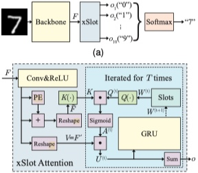

# Classificazione-di-aritmie-cardiache-mediante-Convolutional-Neural-Network

Progetto di Tesi presso l'Università "Parthenope" di Napoli.

Classificatore originale --> https://arxiv.org/abs/2009.06138


## Abstract
Le malattie cardiovascolari sono una delle principali malattie che minacciano la vita umana. Secondo i rapporti dell'organizzazione mondiale della sanità, oggi la mortalità per malattie cardiovascolari (CVD) è al primo posto tra tutte le cause di morte. Oltre 17,7 milioni di persone sono morte per CVD e più del 75% di questi decessi si è verificato nei paesi in via di sviluppo. Inoltre, la mortalità per malattie cardiovascolari (CVD) è ancora in crescita. Pertanto, il monitoraggio regolare del ritmo cardiaco è diventato una questione sempre più importante e necessaria per gestire e prevenire le CVD. Siccome l'Intelligenza Artificiale spiegabile (EAI), negli ultimi anni, ha fatto passi da gigante anche nel settore medico, si è cercato di produrre un software in grado di permettere ai cardiologi, primari e dottori del settore di poter, dato l’ECG di un paziente, riconoscere tutte le eventuali problematiche cardiache di cui è soggetto quest’ultimo. Tale software ha, quindi, come obiettivo, quello di automatizzare e velocizzare profondamente l’operazione di analisi, effettuata dai medici, degli ECG dei pazienti, in maniera tale da non far durare questa fase ore o addirittura giorni.

## Model Structure


SCOUTER is built on top of the recently-emerged slot attention, which offers an object-centric approach for image representation. Based on this approach, we propose an explainable slot attention (xSlot) module. The output from the xSlot module is directly used as the confidence values for each category and thus commonly used fully-connected (FC) layer-based classifiers are no longer necessary. The whole network, including the backbone, is trained with the SCOUTER loss, which provides control over the size of explanatory regions and switching between positive and negative explanations.


##### Pre-training

```bash
python train.py --dataset CUB200 --model resnest50d --batch_size 64 --epochs 150 \
--num_classes 25 --use_slot false --vis false --channel 2048 \
--dataset_dir ../data/bird_200/CUB_200_2011/CUB_200_2011/
```

##### Training per Positive Scouter

```bash
python train.py --dataset CUB200 --model resnest50d --batch_size 64 --epochs 150 \
--num_classes 25 --use_slot true --use_pre true --loss_status 1 --slots_per_class 5 \
--power 2 --to_k_layer 3 --lambda_value 10 --vis false --channel 2048 --freeze_layers 2 \
--dataset_dir ../data/bird_200/CUB_200_2011/CUB_200_2011/
```

##### Training per Negative Scouter

```bash
python train.py --dataset CUB200 --model resnest50d --batch_size 64 --epochs 150 \
--num_classes 25 --use_slot true --use_pre true --loss_status -1 --slots_per_class 3 \
--power 2 --to_k_layer 3 --lambda_value 1. --vis false --channel 2048 --freeze_layers 2 \
--dataset_dir ../data/bird_200/CUB_200_2011/CUB_200_2011/
```

##### Test Positive Scouter

```bash
python test.py --dataset CUB200 --model resnest50d --batch_size 64 --epochs 150 \
--num_classes 25 --use_slot true --use_pre true --loss_status 1 --slots_per_class 5 \
--power 2 --to_k_layer 3 --lambda_value 10 --vis true --channel 2048 --freeze_layers 2 \
--dataset_dir ../data/bird_200/CUB_200_2011/CUB_200_2011/
```

##### Test Negative Scouter

```bash
python test.py --dataset CUB200 --model resnest50d --batch_size 64 --epochs 150 \
--num_classes 25 --use_slot true --use_pre true --loss_status -1 --slots_per_class 3 \
--power 2 --to_k_layer 3 --lambda_value 1. --vis true --channel 2048 --freeze_layers 2 \
--dataset_dir ../data/bird_200/CUB_200_2011/CUB_200_2011/
```


Anno Accademico 2021/2022


